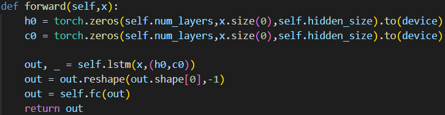
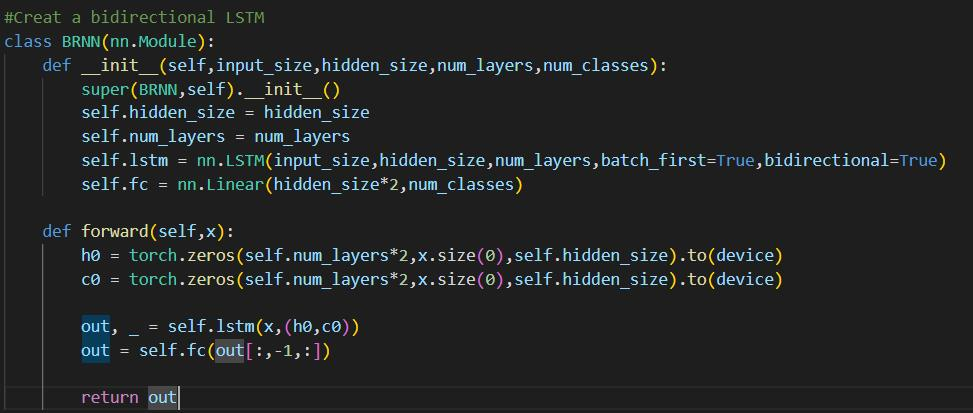
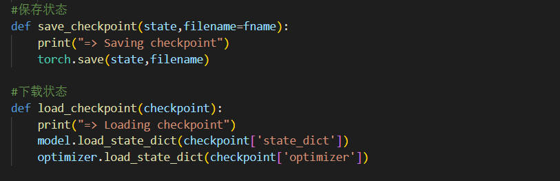
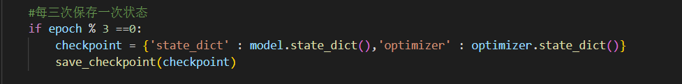

<h1>class_two</h1>
<h2>NN模型识别结果</h2>

Got 56077 / 60000 with accuracy 93.46 
Got 9329 / 10000 with accuracy 93.29

<h2>CNN模型识别结果</h2>

Got 57810 / 60000 with accuracy 96.35 
Got 9667 / 10000 with accuracy 96.67

<h2>RNN模型</h2>

一般用于文字识别（语音），一般不用于图像识别

Got 57537 / 60000 with accuracy 95.89 
Got 9609 / 10000 with accuracy 96.09

将RNN改成GRU准确率为： 
Got 59439 / 60000 with accuracy 99.06 
Got 9879 / 10000 with accuracy 98.79

<i>也可将RNN改为LSTM</i></r>

<h2>BRNN:双向</h2>
<i>链接输入乘2</i>

<h2>保存，下载状态</h2>

